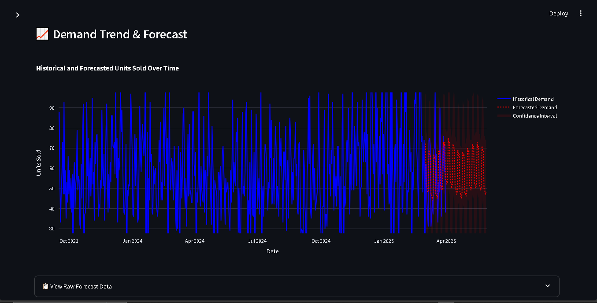
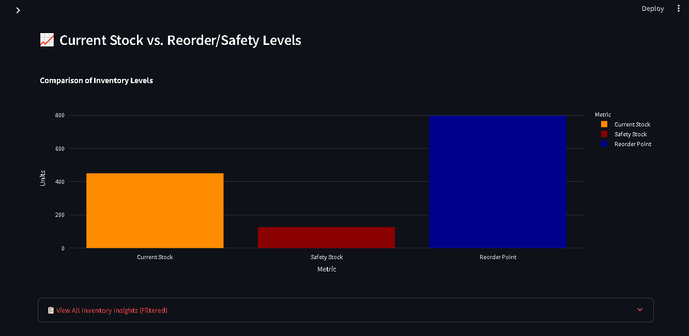

# Supply Chain Optimization Dashboard

## Project Overview

This project provides an interactive dashboard for optimizing supply chain operations. It covers **Demand Forecasting**, **Inventory Management**, and **Supplier Analytics** to help businesses make informed decisions regarding stock levels, future demand, and supplier performance.

The dashboard uses simulated data to demonstrate key functionalities.

## Key Features

* **Demand Forecasting:** Visualize historical demand and future predictions with accuracy metrics.
  
* 
  
* **Inventory Management:** Track current stock, calculate optimal safety stock, reorder points, and reorder quantities.
* **Supplier Analytics:** Monitor supplier performance, including on-time delivery rates and average lead times.
* **Interactive Filters:** Analyze data by product, location, supplier, and custom date ranges.

* 

## Technology Stack

* **Python:** Core programming language
* **Pandas:** Data manipulation
* **Prophet:** Time series forecasting
* **Streamlit:** Interactive web dashboard
* **Plotly:** Data visualization

## Maintainer

**Hamsika Chintakuntla**
Data Analyst
Email: chintakuntlahamsika@gmail.com

### About the Developer
Hamsika is a Data Analyst with over 4 years of experience delivering data-driven solutions across financial services and healthcare technology. She specializes in SQL, Python, and business intelligence tools to transform complex datasets into actionable insights. Her expertise includes building ETL/ELT pipelines, developing interactive dashboards, and implementing statistical analysis to support predictive decision-making and operational efficiency. Her technical toolkit includes Pandas, NumPy, Scikit-learn, and experience with AI-powered analytics.